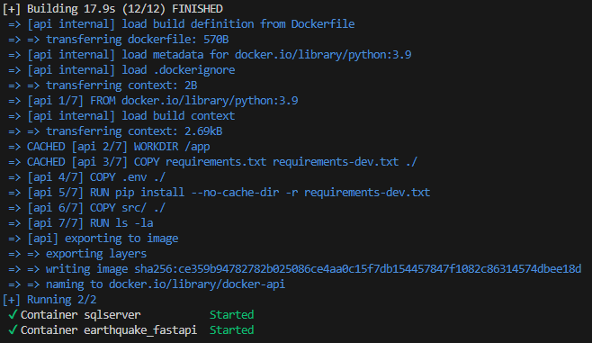
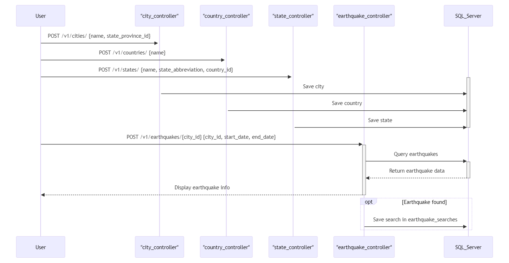

# Getting Started

## Elements

- FastAPI
- SQL Server
- Docker

### Prerequisites

Please install [`Docker` and `Docker compose`](https://www.docker.com/) first.

## Manual setup
After installation, run the following command to create a local Docker container.

```sh
docker compose -f .docker/docker-compose.yml up -d --build
```
---

If Docker is running successfully, the API and DB server will be launched as shown in the following:

- API server: http://localhost:8000
- API Docs: http://localhost:8000/v1/docs
- DB server: http://localhost:1433

_Be careful, it won't work if the port is occupied by another application._

The output expected is somethink like this:



```sh
make setup
```

Remember that active venv before run the commands.

```sh
. .venv/bin/activate
```

### Run environment

To create a SQL that will be use for the application, you need to run the command bellow:

```sh
make db-create
```

After executing this command, run the command below to create the necessary entities for the application to run successfully:

```sh
make db-upgrade
```


---
## How to use the created service? 

Some entities have been created in the database in addition to city. The following tables were created:

- cities
- states
- countries
- earthquake_searches

Before executing the query that will return the nearest earthquake with a magnitude > 5, it is necessary to register these pieces of information first, starting with the country, then the state, and finally the city. After these data are registered, it will then be possible to perform the main query.

To help retrieve the IDs generated for each record in the database, I have created additional endpoints that list all the countries, states, and cities created.

The contracts for each endpoint can be easily found at the link http://localhost:8000/v1/docs

# Database Migrations (Alembic)

Alembic is a database migration tool that provides version control for schema changes, allowing incremental updates. It integrates seamlessly with SQLAlchemy, supports SQL and Python for migrations, and facilitates tracking and reversing schema modifications. Alembic is compatible with SQL Server and enhances data security through controlled schema updates, making it ideal for professional and scalable environments. Just show some example about how it works:

Each time a model is created or modified, it is necessary to run the 2 steps below:

Create a new migration:

```sh
db-migrate msg="some msg"
```

You need check de migration file generated by the last command and if all is correct, then run the command bellow:

```sh
db-upgrade
```
[Reference](https://alembic.sqlalchemy.org/en/latest/tutorial.html#create-a-migration-script)

--

Downgrade to a previous version:

```sh
alembic downgrade -1
```
[Reference](https://alembic.sqlalchemy.org/en/latest/tutorial.html#downgrading)

---

# Tests

Located in `tests` folder. The structure is:
```sh
tests
    ├── __init__.py
    ├── conftest.py
    └── unit
```

Run command:
```sh
make test
```

Run coverage:
```sh
make test-coverage
coverage html
```
---

# Sequence Diagram


# Docker Images

- [SQL Server](https://hub.docker.com/_/microsoft-azure-sql-edge)